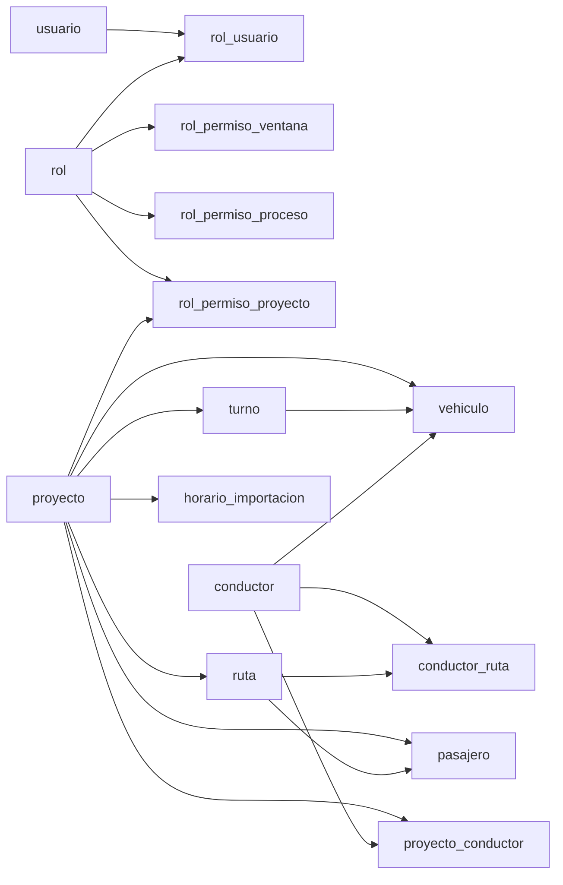

# Diccionario de datos — Seroptrans

Documento generado a partir de los modelos SQL/SQLAlchemy en `backend/app/models/`. Los nombres de tabla y columnas reflejan el mapeo ORM; el tipo físico en el motor puede variar ligeramente (por ejemplo `NUMERIC` / `DECIMAL`).

**Fuentes:**

- Mixin de auditoría: [`backend/app/models/audit.py`](../backend/app/models/audit.py)
- Modelos: [`backend/app/models/`](../backend/app/models/)

---

## Campos comunes de auditoría (`AuditMixin`)

Todas las tablas de negocio listadas incluyen:

| Columna               | Tipo         | Nulo     | Notas                                      |
|-----------------------|-------------|----------|--------------------------------------------|
| `fecha_creacion`      | `DateTime`  | NOT NULL | Valor por defecto al insertar (`utcnow`)   |
| `creado_por`          | `String(32)`| NULL     | `usuario_id` del creador                   |
| `fecha_actualizacion` | `DateTime`  | NULL     | Actualización en `onupdate` (`utcnow`)     |
| `actualizado_por`     | `String(32)`| NULL     | `usuario_id` del último editor             |

---

## `usuario`

| Columna          | Tipo           | PK  | Único | Índice | Nulo     | Notas                          |
|------------------|----------------|-----|-------|--------|----------|--------------------------------|
| `usuario_id`     | `String(32)`   | Sí  | —     | —      | NOT NULL | UUID hex, default generado    |
| `login`          | `String(30)`   | —   | Sí    | Sí     | NOT NULL |                                |
| `password`       | `String(255)`  | —   | —     | —      | NOT NULL |                                |
| `nombre_usuario` | `String(60)`   | —   | —     | —      | NOT NULL |                                |
| `email`          | `String(60)`   | —   | —     | —      | NULL     |                                |
| `telefono`       | `Numeric(10)`  | —   | —     | —      | NULL     |                                |
| `direccion`      | `String(200)`  | —   | —     | —      | NULL     |                                |
| `fotografia`     | `LargeBinary`  | —   | —     | —      | NULL     |                                |

**Relaciones:** colección `roles` hacia `rol_usuario` (cascade sobre asignaciones).

---

## `rol`

| Columna       | Tipo           | PK  | Nulo     |
|---------------|----------------|-----|----------|
| `rol_id`      | `String(32)`   | Sí  | NOT NULL |
| `nombre`      | `String(60)`   | —   | NOT NULL |
| `descripcion` | `String(200)`  | —   | NULL     |

**Relaciones:** `usuarios` (`rol_usuario`), `permisos_ventana`, `permisos_proceso`, `permisos_proyecto`.

---

## `rol_usuario`

| Columna      | Tipo         | PK  | FK                   | ondelete | Nulo     |
|--------------|-------------|-----|----------------------|----------|----------|
| `roluser_id` | `String(32)`| Sí  | —                    | —        | NOT NULL |
| `rol_id`     | `String(32)`| —   | `rol.rol_id`         | CASCADE  | NOT NULL |
| `usuario_id` | `String(32)`| —   | `usuario.usuario_id` | CASCADE  | NOT NULL |

---

## `rol_permiso_ventana`

| Columna      | Tipo           | PK  | FK           | Nulo     |
|--------------|----------------|-----|--------------|----------|
| `rolwin_id`  | `String(32)`   | Sí  | —            | NOT NULL |
| `rol_id`     | `String(32)`   | —   | `rol.rol_id` | NOT NULL |
| `ventana`    | `String(100)`  | —   | —            | NOT NULL |

---

## `rol_permiso_proceso`

| Columna     | Tipo           | PK  | FK           | Nulo     |
|-------------|----------------|-----|--------------|----------|
| `rolpro_id` | `String(32)`   | Sí  | —            | NOT NULL |
| `rol_id`    | `String(32)`   | —   | `rol.rol_id` | NOT NULL |
| `proceso`   | `String(100)`  | —   | —            | NOT NULL |

---

## `rol_permiso_proyecto`

| Columna       | Tipo           | PK  | FK                       | Nulo     |
|---------------|----------------|-----|--------------------------|----------|
| `rolproy_id`  | `String(32)`   | Sí  | —                        | NOT NULL |
| `rol_id`      | `String(32)`   | —   | `rol.rol_id`             | NOT NULL |
| `proyecto_id` | `String(32)`   | —   | `proyecto.proyecto_id`   | NOT NULL |

---

## `proyecto`

| Columna                 | Tipo            | PK  | Nulo     | Notas                                              |
|-------------------------|-----------------|-----|----------|----------------------------------------------------|
| `proyecto_id`           | `String(32)`    | Sí  | NOT NULL |                                                    |
| `nombre`                | `String(100)`   | —   | NOT NULL |                                                    |
| `descripcion`           | `String(300)`   | —   | NULL     |                                                    |
| `parametros_operativos` | `Text`          | —   | NULL     | Texto JSON lógico (ocupación máxima, costos, etc.) |
| `activo`                | `Boolean`       | —   | NOT NULL | Default `True`                                     |

**Relaciones:** `turnos`, `rutas`, `pasajeros`, `conductores` (`proyecto_conductor`), `vehiculos`.

---

## `turno`

| Columna       | Tipo           | PK  | FK                       | Nulo     | Notas                    |
|---------------|----------------|-----|--------------------------|----------|--------------------------|
| `turno_id`    | `String(32)`   | Sí  | —                        | NOT NULL |                          |
| `proyecto_id` | `String(32)`   | —   | `proyecto.proyecto_id`   | NOT NULL | ondelete CASCADE         |
| `nombre`      | `String(60)`   | —   | —                        | NOT NULL | Ej.: mañana / noche      |
| `descripcion` | `String(200)`  | —   | —                        | NULL     |                          |
| `activo`      | `Boolean`      | —   | —                        | NOT NULL | Default `True`           |

---

## `ruta`

| Columna       | Tipo             | PK  | FK                       | Nulo     | Notas                                                 |
|---------------|------------------|-----|--------------------------|----------|-------------------------------------------------------|
| `ruta_id`     | `String(32)`     | Sí  | —                        | NOT NULL |                                                       |
| `proyecto_id` | `String(32)`     | —   | `proyecto.proyecto_id`   | NOT NULL | ondelete CASCADE                                      |
| `nombre`      | `String(100)`    | —   | —                        | NOT NULL |                                                       |
| `sector`      | `String(100)`    | —   | —                        | NULL     |                                                       |
| `geocerca`    | `Text`           | —   | —                        | NULL     | GeoJSON u otras coordenadas en texto                  |
| `costo_base`  | `Numeric(10, 2)` | —   | —                        | NULL     |                                                       |
| `tipo`        | `String(20)`     | —   | —                        | NOT NULL | Default `diurna`; valores lógicos: diurna, nocturna, ambas |
| `activo`      | `Boolean`        | —   | —                        | NOT NULL | Default `True`                                        |

---

## `conductor`

| Columna        | Tipo           | PK  | Nulo     | Notas          |
|----------------|----------------|-----|----------|----------------|
| `conductor_id` | `String(32)`   | Sí  | NOT NULL |                |
| `nombre`       | `String(100)`  | —   | NOT NULL |                |
| `disponible`   | `Boolean`      | —   | NOT NULL | Default `True` |
| `activo`       | `Boolean`      | —   | NOT NULL | Default `True` |

**Relaciones:** `vehiculos`, `proyectos` (`proyecto_conductor`), `rutas_asignadas` (`conductor_ruta`).

---

## `conductor_ruta`

| Columna            | Tipo           | PK  | FK                         | Nulo     | Notas                |
|--------------------|----------------|-----|----------------------------|----------|----------------------|
| `conductorruta_id` | `String(32)`   | Sí  | —                          | NOT NULL |                      |
| `conductor_id`     | `String(32)`   | —   | `conductor.conductor_id`   | NOT NULL | ondelete CASCADE     |
| `ruta_id`          | `String(32)`   | —   | `ruta.ruta_id`             | NOT NULL | ondelete CASCADE     |
| `tipo`             | `String(20)`   | —   | —                          | NOT NULL | diurna / nocturna    |

---

## `proyecto_conductor`

| Columna          | Tipo           | PK  | FK                       | Nulo     |
|------------------|----------------|-----|--------------------------|----------|
| `proyectocon_id` | `String(32)`   | Sí  | —                        | NOT NULL |
| `proyecto_id`    | `String(32)`   | —   | `proyecto.proyecto_id`   | NOT NULL |
| `conductor_id`   | `String(32)`   | —   | `conductor.conductor_id` | NOT NULL |

Ambas FK con `ondelete CASCADE`.

---

## `vehiculo`

| Columna        | Tipo           | PK  | FK                         | ondelete  | Nulo     | Notas          |
|----------------|----------------|-----|----------------------------|-----------|----------|----------------|
| `vehiculo_id`  | `String(32)`   | Sí  | —                          | —         | NOT NULL |                |
| `placa`        | `String(20)`   | —   | —                          | —         | NOT NULL |                |
| `capacidad`    | `Integer`      | —   | —                          | —         | NOT NULL | Default `16`   |
| `conductor_id` | `String(32)`   | —   | `conductor.conductor_id`   | SET NULL  | NULL     |                |
| `turno_id`     | `String(32)`   | —   | `turno.turno_id`           | CASCADE   | NOT NULL |                |
| `proyecto_id`  | `String(32)`   | —   | `proyecto.proyecto_id`     | CASCADE   | NOT NULL |                |
| `activo`       | `Boolean`      | —   | —                          | —         | NOT NULL | Default `True` |

---

## `pasajero`

| Columna            | Tipo             | PK  | FK                       | ondelete  | Nulo     | Notas          |
|--------------------|------------------|-----|--------------------------|-----------|----------|----------------|
| `pasajero_id`      | `String(32)`     | Sí  | —                        | —         | NOT NULL |                |
| `proyecto_id`      | `String(32)`     | —   | `proyecto.proyecto_id`   | CASCADE   | NOT NULL |                |
| `cedula`           | `String(20)`     | —   | —                        | —         | NOT NULL |                |
| `nombre`           | `String(100)`    | —   | —                        | —         | NOT NULL |                |
| `direccion`        | `String(300)`    | —   | —                        | —         | NULL     |                |
| `lat`              | `Numeric(10, 7)` | —   | —                        | —         | NULL     |                |
| `lng`              | `Numeric(10, 7)` | —   | —                        | —         | NULL     |                |
| `ruta_id`          | `String(32)`     | —   | `ruta.ruta_id`           | SET NULL  | NULL     |                |
| `horario_habitual` | `String(50)`     | —   | —                        | —         | NULL     |                |
| `placa_asignada`   | `String(20)`     | —   | —                        | —         | NULL     |                |
| `activo`           | `Boolean`        | —   | —                        | —         | NOT NULL | Default `True` |

---

## `horario_importacion`

Registro por cada intento de importación de horarios (URL enviada al webhook n8n y respuesta guardada).

| Columna                   | Tipo           | PK  | FK                       | Nulo     | Notas                          |
|---------------------------|----------------|-----|--------------------------|----------|--------------------------------|
| `horario_importacion_id`  | `String(32)`   | Sí  | —                        | NOT NULL |                                |
| `proyecto_id`             | `String(32)`   | —   | `proyecto.proyecto_id`   | NOT NULL | ondelete CASCADE               |
| `anio`                    | `Integer`      | —   | —                        | NOT NULL | Año ISO 8601 de la semana elegida |
| `numero_semana`           | `Integer`      | —   | —                        | NOT NULL | Número de semana ISO (1–52/53) |
| `url_archivo`             | `Text`         | —   | —                        | NOT NULL | URL del Excel / export         |
| `respuesta_msg`           | `Text`         | —   | —                        | NULL     | Mensaje devuelto por n8n       |
| `respuesta_code`          | `Integer`      | —   | —                        | NULL     | Ej. código de validación       |
| `respuesta_title`         | `String(300)`  | —   | —                        | NULL     | Título devuelto por n8n        |
| `respuesta_raw`           | `Text`         | —   | —                        | NULL     | Cuerpo JSON completo (opcional) |

Incluye columnas de [`AuditMixin`](../backend/app/models/audit.py) (`fecha_creacion`, `creado_por`, etc.).

---

## Diagrama de relaciones (lógico)

---

## Mantenimiento

Al cambiar modelos o migraciones Alembic, conviene actualizar este documento o regenerarlo desde el esquema real (`alembic history`, `CREATE TABLE` en la base, etc.) para reflejar índices únicos compuestos u otras restricciones no visibles solo en los modelos.
